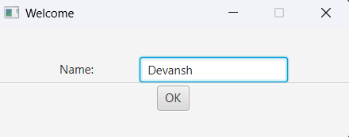
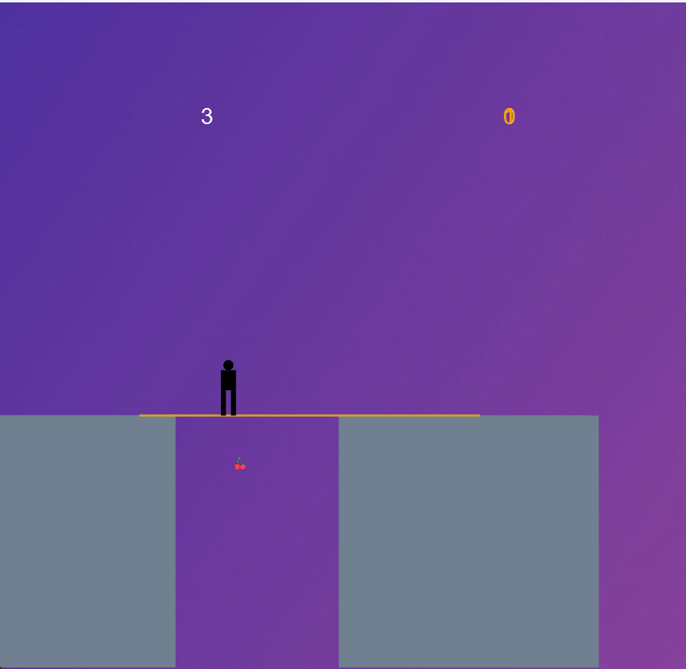
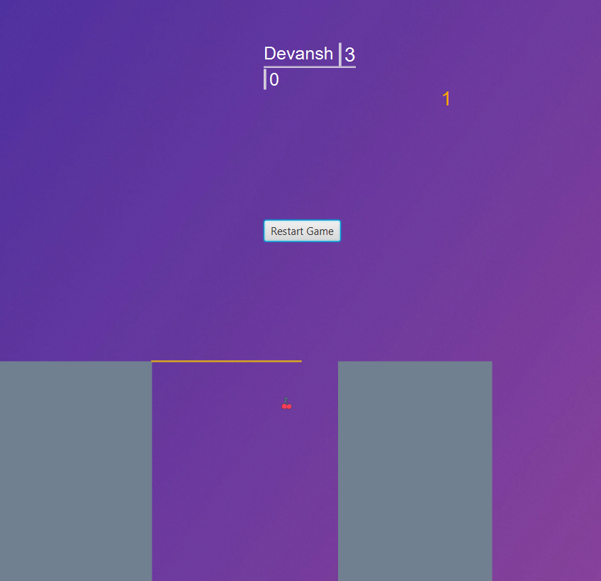

# 🕹️ Stick Hero – JavaFX Platformer Game

A fully interactive 2D platformer game built in **Java** using **JavaFX**, featuring real-time animations, physics-inspired mechanics, score tracking, and user input handling. Inspired by the popular Stick Hero mobile game, this project demonstrates core software engineering principles in game development, UI design, and event-driven programming.

---

## 🚀 Features

* 🎮 **Real-time Gameplay Logic**
  Dynamic stick extension, bridge traversal, cherry collection, and score-based level progression.

* 💻 **JavaFX UI & Animations**
  Smooth transitions using `PathTransition` and `FadeTransition`, custom-rendered player character, and animated game-over effects.

* ⌨️ **Keyboard & Mouse Controls**
  Stick mechanics via mouse press + release, movement using `F` key, and inverse movement via `I`.

* 💾 **File-Based High Score System**
  Stores and displays player scores across sessions using local file I/O.

* 🔁 **Restartable Sessions**
  Seamless restart functionality with state cleanup and UI refresh.

---

## 🛠️ Tech Stack

| Tool         | Purpose                          |
| ------------ | -------------------------------- |
| Java         | Core programming language        |
| JavaFX       | UI framework for game rendering  |
| OOP + Events | Game logic, UI control, and flow |
| File I/O     | High score persistence           |

---

## 📷 Screenshots

| Welcome Screen              | Gameplay                      | Game Over                     |
| --------------------------- | ----------------------------- | ----------------------------- |
|  |  |  |

---

## 🎮 How to Play

1. **Launch the game** (`Main.java`)
2. Enter your name in the welcome screen
3. Press and hold mouse button to grow the stick

   * Left click = grow downwards
   * Right click = grow upwards
4. Press **`F`** to drop the stick and walk across
5. Press **`I`** to perform inverse movement (flip)
6. Collect cherries and increase your score!
7. Game ends if the stick doesn't reach the next platform

---

## 📁 File Structure

```
StickHero/
├── src/
│   ├── Main.java
│   ├── StickHero.java
│   └── GameObserver.java
├── img/
│   ├── background.png
│   └── cherry.png
├── files/
│   └── best.txt
```

---

## 🧠 Concepts Demonstrated

* JavaFX graphics rendering and scene control
* Threading for animation and gameplay flow
* Object-oriented design with observer pattern
* Input-driven event handling
* Game state management and persistence

---

## 📝 Future Improvements

* Add difficulty scaling or level design
* Include sound effects and music
* Support touchscreen or mobile port
* Integrate leaderboard via database

---

## 📌 Setup Instructions

1. Clone the repository

   ```bash
   git clone https://github.com/kumardevansh/StickHero.git
   cd StickHero-JavaFX
   ```
2. Open the project in any Java IDE (e.g., IntelliJ, Eclipse)
3. Make sure JavaFX is set up in your project libraries
4. Run `Main.java` as a Java application
5. Make sure the `/img` and `/files` folders are accessible in your working directory
